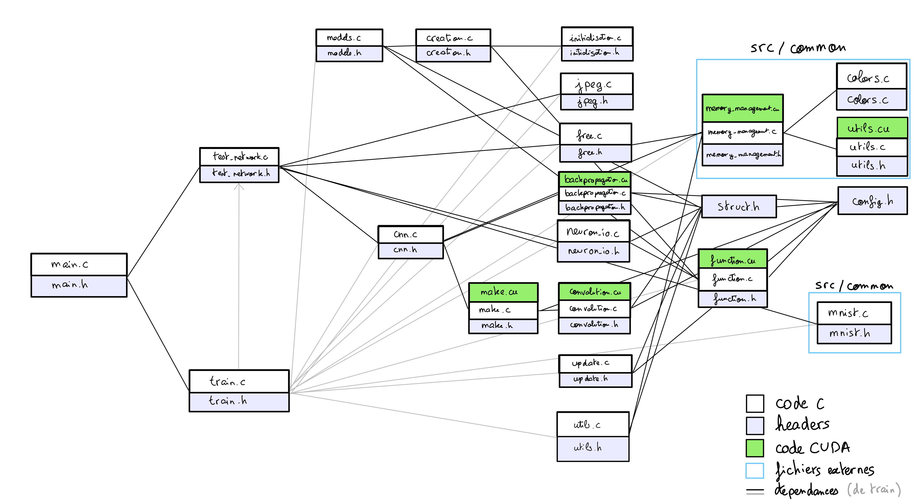

TIPE en MP2I puis MPI* 2021-2023  
Julien CHEMILLIER, Augustin LUCAS


_Uniquement les dépendances de `src/cnn` sont représentées_

- [Objectifs](#objectifs)
    + [Objectif principal](#objectif-principal)
    + [Découpage du projet](#découpage-du-projet)
- [Résultats](#résultats-selon-ce-découpage)
    + [Réseau dense](#réseau-dense)
    + [Réseau convolutif](#réseau-convolutif)
    + [Optimisations](#optimisations)
        - [Adam Optimizer](#adam-optimizer)
        - [Utilisation de la carte graphique](#utilisation-de-la-carte-graphique)
- [Utilisation](#utilisation)
    + [Dépendances](#dépendances)
    + [Compilation](#compilation)
    + [Exécution](#exécution)
- [Références bibliographiques](#références-bibliographiques)

# Objectifs
## Objectif principal
Classification de villes à l'aide d'un réseau de neurones convolutif.  
Le réseau sera codé en C en limitant les utilisations de librairies tierces.  
Les images de villes sont des photos au sol (Google street view)  
<br/><br/>

## Découpage du projet
1. Créer un réseau de neurones "basique", constitué uniquement de couches denses pour se familiariser avec la structure de réseaux de neurones et le langage C qui n'avait que peu été étudié auparavant.
2. Créer un réseau de neurones convolutif plus efficace sur des images de grande taille.
3. Implémenter différentes techniques d'optimisation du temps de calcul (utilisation du GPU) et du nombre d'itérations (Adam Optimizer)
4. Implémenter les détails nécessaires pour avoir un réseau sous la structure d'AlexNet fonctionnel. Le tester sur les images de villes

Les trois premières étapes se feront sur le jeu de données [MNIST](#références-bibliographiques) pour des calculs plus adaptés à une phase de développement. Après avoir validé le fonctionnement de ces réseaux, le réseau créé à l'étape 3 sera utilisé sur le jeu de données [50States10K](#références-bibliographiques).

<br/><br/>

# Résultats selon ce découpage

## Réseau dense
Le code est disponible dans `src/dense`

<summary>Arborescence du code</summary>
<details>

```
src/dense
├── include
│   ├── main.h
│   ├── neural_network.h
│   ├── neuron.h
│   ├── neuron_io.h
│   └── preview.h
├── main.c
├── neural_network.c
├── neuron_io.c
├── preview.c
└── utils.c

2 directories, 10 files
```

</details><br/>

Résultats sur MNIST:
```
$ build/dense-main train -e 5 -i data/mnist/train-images-idx3-ubyte -l data/mnist/train-labels-idx1-ubyte
Threads [8] Époque [0/5]    Image [60000/60000] Accuracy: 86.7%
Threads [8] Époque [1/5]    Image [60000/60000] Accuracy: 90.0%
Threads [8] Époque [2/5]    Image [60000/60000] Accuracy: 90.5%
Threads [8] Époque [3/5]    Image [60000/60000] Accuracy: 90.8%
Threads [8] Époque [4/5]    Image [60000/60000] Accuracy: 90.9%
Execution time: 50 s.

$ build/dense-main test -i data/mnist/t10k-images-idx3-ubyte -l data/mnist/t10k-labels-idx1-ubyte -m out.bin
10000 Images   Accuracy: 90.4%
```
<br/><br/>

## Réseau convolutif

Le code est disponible dans `src/cnn`

<summary>Arborescence du code</summary>
<details>

```
src/cnn
├── backpropagation.c/.cu
├── cnn.c
├── convolution.c/.cu
├── creation.c
├── export.c
├── free.c
├── function.c/.cu
├── include
│   ├── backpropagation.h
│   ├── cnn.h
│   ├── config.h
│   ├── convolution.h
│   ├── creation.h
│   ├── free.h
│   ├── function.h
│   ├── initialisation.h
│   ├── jpeg.h
│   ├── main.h
│   ├── make.h
│   ├── matrix_multiplication.h
│   ├── neuron_io.h
│   ├── print.h
│   ├── struct.h
│   ├── test_network.h
│   ├── train.h
│   ├── update.h
│   └── utils.h
├── initialisation.c
├── jpeg.c
├── main.c
├── make.c/.cu
├── neuron_io.c
├── preview.c
├── print.c
├── test_network.c
├── train.c
├── update.c
└── utils.c

2 directories, 42 files
```

</details><br/>

Résultats sur MNIST avec l'architecture LeNet-5, avec Leaky RELU en fonction d'activation, des Batchs de taille 32 et le décalage aléatoire des images désactivé:
```
$ build/cnn-main train --dataset mnist --images data/mnist/train-images-idx3-ubyte --labels data/mnist/train-labels-idx1-ubyte --epochs 5
Pas de fichier de sortie spécifié, défaut: out.bin
Taux d'apprentissage initial: 3.00e-04
Initialisation: 185ms

Threads [8] Époque [0/5]    Image [60000/60000] Accuracy: 60.5244%  Loss: 0.046990: Temps: 1mn 31s
Threads [8] Époque [1/5]    Image [60000/60000] Accuracy: 91.3681%  Loss: 0.012858: Temps: 1mn 31s
Threads [8] Époque [2/5]    Image [60000/60000] Accuracy: 93.0354%  Loss: 0.010549: Temps: 1mn 30s
Threads [8] Époque [3/5]    Image [60000/60000] Accuracy: 93.8429%  Loss: 0.009243: Temps: 1mn 29s
Threads [8] Époque [4/5]    Image [60000/60000] Accuracy: 94.4507%  Loss: 0.008328: Temps: 1mn 31s

Temps total: 7mn 33s
$ build/cnn-main test -m out.bin -d mnist -i data/mnist/t10k-images-idx3-ubyte -l data/mnist/t10k-labels-idx1-ubyte
Accuracy: 94.860001 Loss: 0.007952
```
<br/><br/>

## Optimisations

### Adam Optimizer

Configuration dans `src/cnn/config.h`. Cette optimisation peut-être désactivée à la compilation sur chacun des éléments du réseau de manière indépendante

Meilleur taux de réussite sur le jeu de test avec Adam Optimizer (`ADAM_DENSE_WEIGHTS` uniquement): `97.3%`
<br/><br/>

### Utilisation de la Carte Graphique

Un des objectifs principaux de ce TIPE étant également de réaliser un réseau de neurones n'utilisant pas de bibliothèques extérieures pour plus de clarté, seulement la gestion de la mémoire partagée sera faite "en boîte noire". Par exemple, on essayera d'éviter les appels aux fonctions de multiplication de matrices ou de convolution toute faites.

Pour utiliser la carte graphique, toutes les données traitées par le GPU doivent être copiées dans la mémoire de celui-ci, mais la manière dont cela est géré impose d'allouer des blocs de 48kB de mémoire pour en éviter une saturation très rapide. Une "surcouche" à la gestion de la mémoire est donc implémentée dans `src/cnn/memory_management.cu`

Résultats avec VGG16, pour des images de 256x256 pixels (seulement une plus petite image de 227x227 pixels est en réalité utilisée):
|Tâche|Temps GPU|Temps CPU|
|---|---|---|
|Forward|1s 200ms|66s|
|Backward|22s 400ms|90s|

</details>
<br/><br/>

# Utilisation

Sur le cloud avec google Colab: bon GPU mais mauvais processeur: [](https://colab.research.google.com/drive/1LfwSrQRaoC91yC9mx9BKHzuc7odev5r6?usp=sharing)

## Dépendances
- `cuda` : pour utiliser la carte graphique (NVIDIA seulement)
- `libjpeg-dev` : n'est pas nécessairement installé par défaut
- GNU `make` : installé par défaut sur la majorité des distributions Linux et sur MacOS
- `gcc` : installé par défaut sur la majorité des distributions Linux et sur MacOS

### Linux
Les distributions suivantes ont étés essayées, il faudra parfois installer `libjpeg`
- Arch  
- Fedora  
- Manjaro  
- Ubuntu: `apt install libjpeg-dev`

### MacOS
Avec [Homebrew](https://brew.sh/):
```bash
brew install libjpeg
```

## Compilation

Compiler tous les exécutables:
```bash
make -j all
```

Exécuter tous les tests: (Attention, si cuda est installé mais qu'aucune carte graphique n'est disponible, cela peut prendre plusieurs minutes)
```bash
make -j run-tests
```


## Exécution

Exécuter un fichier compilé (disponible dans `build/`) sans arguments affichera une aide rapide.  
Se référer à `doc/{cnn,dense}` pour avoir des informations plus détaillées.

<br/><br/>

# Références bibliographiques
|Année|Titre|Auteur|Lien|
|---|---|---|---|
|1998|LeNet-5, convolutional neural networks|Yann Lecun et al.|http://yann.lecun.com/exdb/lenet/index.html
|1998|THE MNIST DATABASE of handwritten digits|Yann LeCun, Corinna Cortes, Christopher J.C. Burges|http://yann.lecun.com/exdb/mnist/
|2008|IM2GPS: estimating geographic information from a single image|James Hays and Alexei A. Efros|http://graphics.cs.cmu.edu/projects/im2gps/im2gps.pdf
|2012|ImageNet Classification with Deep Convolutional Neural Networks|Alex Krizhevsky, Ilya Sutskever, Geoffrey E. Hinton|https://papers.nips.cc/paper/2012/file/c399862d3b9d6b76c8436e924a68c45b-Paper.pdf
|2014|Adam: A Method for Stochastic Optimization|Diederik P. Kingma, Jimmy Ba|https://arxiv.org/abs/1412.6980
|2014|Very Deep Convolutional Networks for Large-Scale Image Recognition|Karen Simonyan, Andrew Zisserman|https://arxiv.org/abs/1409.1556
|2016|PlaNet - Photo Geolocation with Convolutional Neural Networks|Tobias Weyand, Ilya Kostrikov, James Philbin|https://arxiv.org/abs/1602.05314
|2017|Fashion-MNIST: a Novel Image Dataset for Benchmarking Machine Learning Algorithms|Han Xiao, Kashif Rasul, Roland Vollgraf|https://arxiv.org/abs/1708.07747
|2017|Recent Advances in Convolutional Neural Network|Jiuxiang Gua, Zhenhua Wangb, Jason Kuen et al.|https://arxiv.org/abs/1512.07108
|2018|DeepGeo: Photo Localization with Deep Neural Network|Sudharshan Suresh, Nathaniel Chodosh, Montiel Abello|https://arxiv.org/abs/1810.03077