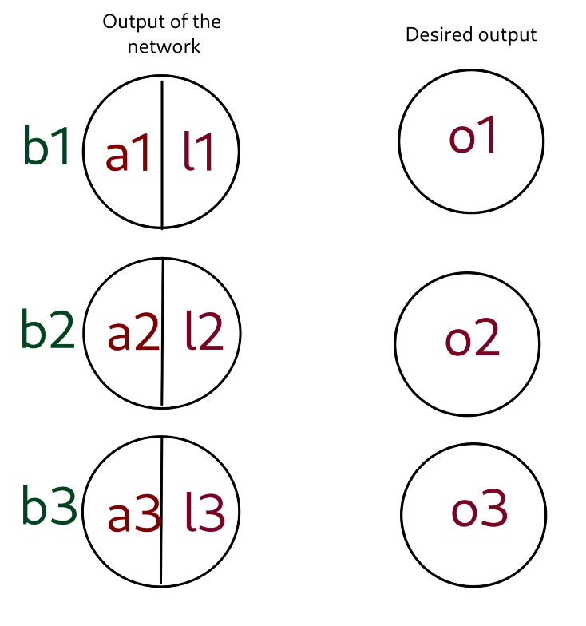
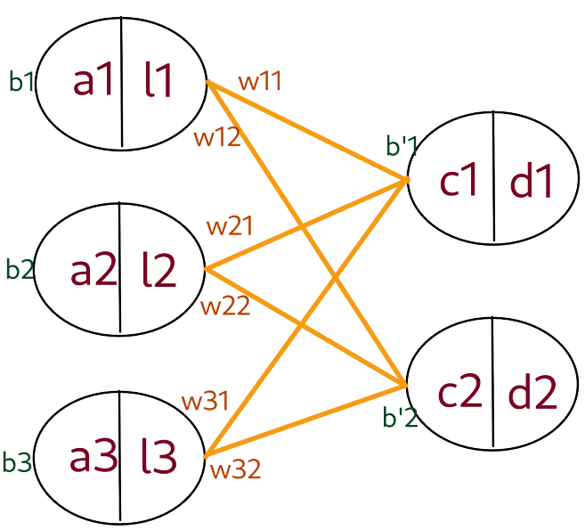
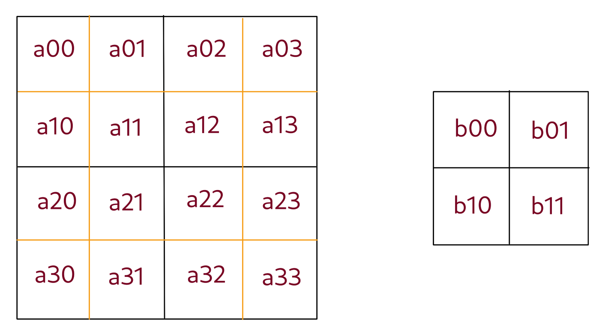
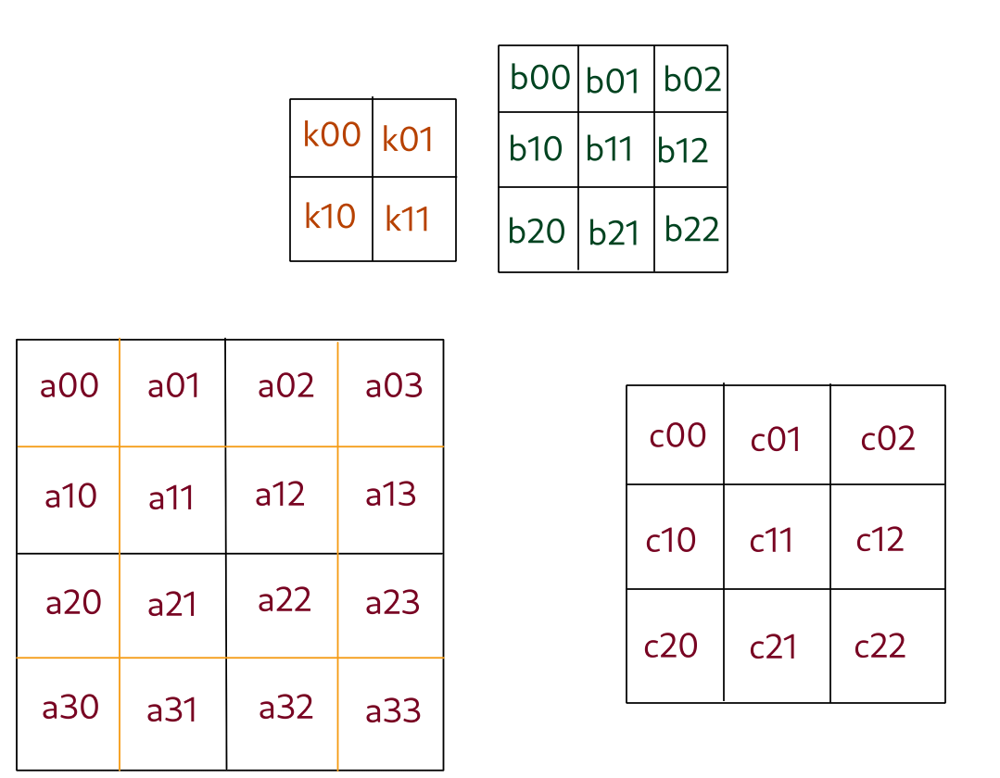

# Explication des calculs de la backpropagation des différentes couches

## Backpropagation de la dernière couche avec softmax

La couche ($o_1$, $o_2$, $o_3$) contient les valeurs que le réseau devrait donner idéalement.  
La couche ($l_1$, $l_2$, $l_3$) contient les valeurs que le réseau donne réellement.  
Soit f la fonction d'activation de la première couche (qui transforme les $a_i$ en $l_i$).  
Relations entre les différents variables:
- $l_1 = \dfrac{e^{a_1}}{e^{a_1}+e^{a_2}+e^{a_3}}$  
$l_2 = \dfrac{e^{a_2}}{e^{a_1}+e^{a_2}+e^{a_3}}$  
$l_3 = \dfrac{e^{a_3}}{e^{a_1}+e^{a_2}+e^{a_3}}$  
$E = \dfrac{1}{2}((l_1-o_1)^2+(l_2-o_2)^2+(l_3-o_3)^2)$
- $\dfrac{\partial E}{\partial l1} = o_1 - l_1$  
$\dfrac{\partial E}{\partial l2} = o_2 - l_2$  
$\dfrac{\partial E}{\partial l3} = o_3 - l_3$  
- $\dfrac{\partial l_1}{\partial a_1} = l_1(1-l_1)$  
$\dfrac{\partial E}{\partial a_1} = \dfrac{\partial E}{\partial l_1} \dfrac{\partial l_1}{\partial a_1} = (o_1-l_1)l_1(1-l_1)$  

> Derivatives:  
$\dfrac{\partial E}{\partial a_i} = \dfrac{\partial E}{\partial l_i} \dfrac{\partial l_i}{\partial a_i} = (o_i-l_i)l_1(1-l_i)$  
$\dfrac{\partial E}{\partial b_i} = \dfrac{\partial E}{\partial a_i}$

---
---

## Backpropagation of a fully connected layer

Soit f la fonction d'activation de la première couche (qui transforme les $a_i$ en $l_i$) et g la fonction d'activation de la deuxième couche (qui transforme les $c_i$ en $d_i$).
- $d_1 =g(c_1)$  
$d_2 = g(c2)$  
$c_1 = w_{11}l_1 + w_{21}l_2 + w_{31}l_3 + b'_1$  
$c_2 = w_{12}l_1 + w_{22}l_2 + w_{32}l_3 + b'_2$ 
$l_1 = f(a_1)$  
$l_2 = f(a_2)$  
$l_3 = f(a_3)$  
- $\dfrac{\partial E}{\partial a_1} = \dfrac{\partial E_{c_1}}{\partial c_1} \dfrac{\partial c_1}{\partial l_1} \dfrac{\partial l_1}{\partial a_1} + \dfrac{\partial E_{c_2}}{\partial c_2} \dfrac{\partial c_2}{\partial l_1} \dfrac{\partial l_1}{\partial a_1}$  
$\dfrac{\partial c_2}{\partial l_1} = w_{12}$  
$\dfrac{\partial c_1}{\partial l_1} = w_{11}$  
$\dfrac{\partial l_1}{\partial a_1} = f'(a_1)$  

> Dérivées:  
$\dfrac{\partial E}{\partial b_j} = \dfrac{\partial E}{\partial l_i} $  
$\dfrac{\partial E}{\partial w_{ij}} = \dfrac{\partial E}{\partial c_j}l_i$  
$\dfrac{\partial E}{\partial a_i} = \dfrac{\partial E_{c_1}}{\partial c_1} w_{i1} + \dfrac{\partial E_{c_2}}{\partial c_2} w_{i2}$  
---
---

## Backpropagation d'une couche d'average 2d pooling layer

 

Relation entre les différentes variables:  
$\forall i,j: \space b_{i j} = \dfrac{a_{2i \space 2j} + a_{2i+1 \space 2j} + a_{2i \space 2j+1} + a_{2i+1 \space 2j+1}}{4}$

> Dérivées:  
$\forall i,j: \space \dfrac{\partial E}{\partial a_{i \space j}} = \dfrac{1}{4} \dfrac{\partial E}{\partial b_{k \space l}} $  
où $k = \Big\lfloor \dfrac{i}{2} \Big\rfloor$ et $l = \Big\lfloor \dfrac{j}{2} \Big\rfloor$
---
---

## Backpropagation d'une couche convolutive

Les matrices rouges représente les couches n  et n+1.  
La matrice orange représente .  
La matrice verte représente les biais de la couche n+1.  
$\forall i,j: c_{i \space j} = b_{i \space j} + \sum\limits_{0 \leqslant k, l \leqslant 1} \space k_{k \space l} c_{i+k, \space j+l}$  
$ $  

> Dérivées:  
$\dfrac{\partial E}{\partial b_{i,j}} = \dfrac{\partial E}{\partial c_{i, j}}$  
$\dfrac{\partial E}{\partial k_{i,j}} = \sum\limits_{p=0}^{2} \sum\limits_{l=0}^{2} \Big( \dfrac{\partial E}{\partial c_{k \space l}} a_{i+p, j+l}\Big)$  
$\dfrac{\partial E}{\partial a_{i,j}} = \sum\limits_{k=max(0, k\_size-1)}^{min(k\_size, dim\_input-j)} \sum\limits_{l=max(0, k\ _size-1)}^{min(k\_size, dim\_input-k)} \dfrac{}{}$  
